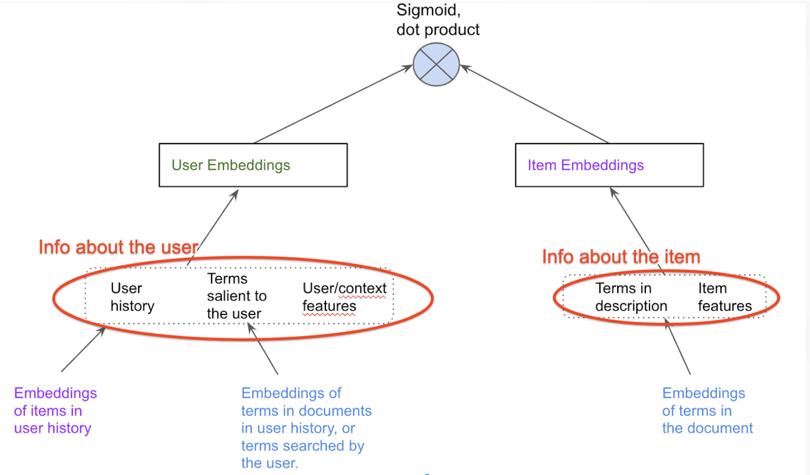
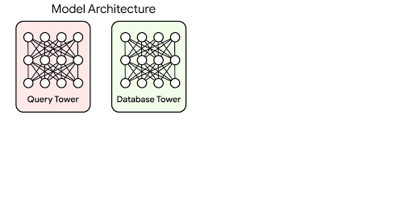
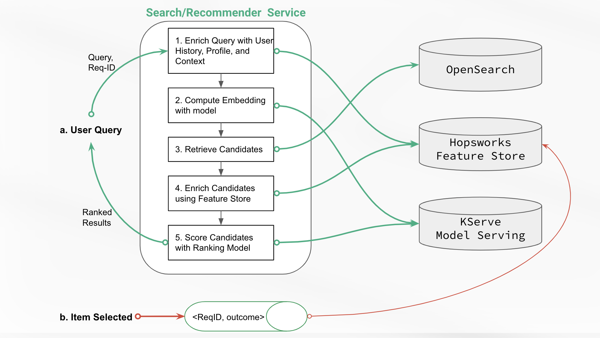

# Recommender and Personalized Search Retrieval and Ranking System

Recommender systems and personalized search systems are information filtering systems that personalize the information coming to a user based on her historical interests, the relevance of the information, and the current context (e.g., what is trending).

## Retrieval and Ranking Stages

[Image credit](https://www.linkedin.com/pulse/personalized-recommendations-iii-user-feedback-gaurav-chakravorty)

## Two Tower Embeddings

These encoders are trained to produce embeddings such that the dot product of a user, item pair that actually interacted is high and the dot product of a non interacting pair is close to 0.

Training data consists of query document and candidate document pairs. You need to provide only positive pairs, where the query and candidate documents are considered a match.

[Image credit](https://cloud.google.com/blog/products/ai-machine-learning/vertex-matching-engine-blazing-fast-and-massively-scalable-nearest-neighbor-search)

## Retrieval and Ranking Service using Hopsworks

## Candidate Retrieval and Ranking Recommender Systems at Scale

Includes:

 * Feature pipeline
 * Model-dependent transformations with sklearn pipelines
 * Batch inference program
 * app.py (interactive UI with Gradio that uses the model to predict if a loan should be approved or not)

